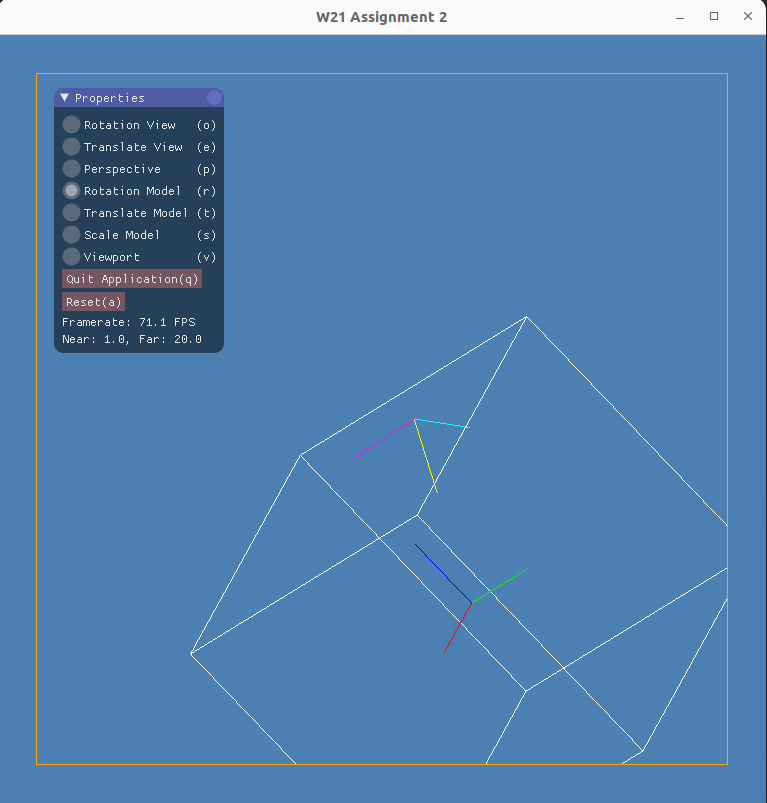

# Compilation of A2

`premake4 gmake`

`make`

This is tested by the Virtual Machine provided by the TAs. I am using a Macbook with a silicon chip.

## Rules
1. Use perspective mode to tune the fov can provide a better view for the cube.

2. Under viewport mode, the viewport can be adjusted dynamically but the size of the cube(the original image) won't be changed.

3. Rotate the view and model to have a better view for the whole thing.

## Result
