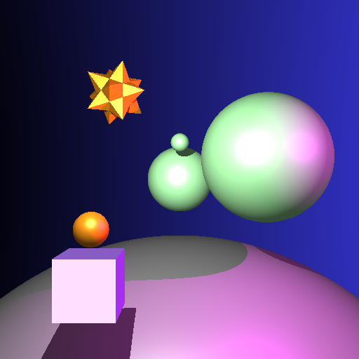

# A3: Puppets

## Compile

Same compilation as before.

`premake4 gmake`

`make`

This is tested by the Virtual Machine provided by the TAs. I am using a Macbook with a silicon chip.

## Result

For complex models, the shadows are not implemented in the right way but without shadows, the result image is of good quality. For non-hierarchical files, the results can be correctly produced.